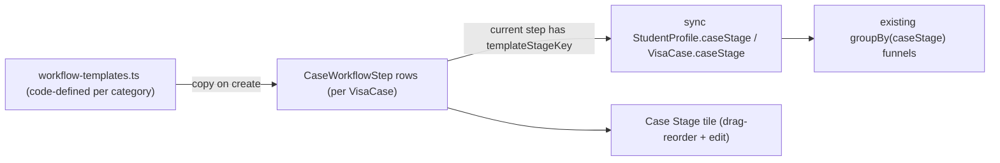

# Editable Per-Client Visa Workflows

## Goal
Move from computed, fixed workflows to **per-client stored workflows** that are copied from a code-defined template at case creation and editable (add / remove / rename / drag-reorder) in the Case Stage tile, while keeping the existing stage funnels/reports working.

## Architecture overview

Key idea for reporting preservation: each step keeps a nullable `templateStageKey` (a `CaseStage` enum value) for default steps and `null` for custom steps. The case's current step syncs its `templateStageKey` back into the existing `caseStage` columns, so `prisma.studentProfile.groupBy({ by: ["caseStage"] })` in the admin/sub-admin/internal-staff dashboards keeps working unchanged. Custom steps bucket under their nearest preceding template anchor.

## 1. New visa categories (no schema change; `visaServiceType` is a free string)
In [src/lib/visa-services.ts](src/lib/visa-services.ts) add to `VISA_SERVICE_OPTIONS`:
- `SUBSEQUENT_VISA` -> "Subsequent Visa"
- `REAPPLICATION_COMBINED_VISA` -> "Reapplication/Combined Visa"
- `STUDENT_EXTENSION` -> "Student Extension"
- `TGV_485_EXTENSION` -> "485 Temporary Graduate Visa Extension"
- `VISA_408` -> "408 Visa"

Separate "student fields" from "workflow": today `isStudentVisaService` (`=== "STUDENT_VISA"`) drives **both** student fields and the workflow. Add a new helper `usesStudentClientFields(value)` returning true for `STUDENT_VISA` + `STUDENT_EXTENSION`. Keep `isStudentVisaService` only where the meaning is genuinely "Student Visa specifically". Switch these **field/validation/display** call sites (verified by grep) to `usesStudentClientFields`:
- [src/components/profile-visa-service-fields.tsx](src/components/profile-visa-service-fields.tsx) (`showStudentFields`)
- [src/components/student-client-intake-form.tsx](src/components/student-client-intake-form.tsx)
- [src/lib/manual-client-intake.ts](src/lib/manual-client-intake.ts) (required-field validation)
- [src/app/apply/apply-form-fields.tsx](src/app/apply/apply-form-fields.tsx)
- [src/app/apply/page.tsx](src/app/apply/page.tsx) — validation (line ~263) and persisted profile fields (lines ~408, ~447-451: `currentEducationLevel` / `targetCourse` / `preferredIntake`)
- [src/app/dashboard/students/[studentId]/page.tsx](src/app/dashboard/students/[studentId]/page.tsx) — profile-edit field gating (`isStudentVisa`, line ~2290)
- [src/lib/visa-services.ts](src/lib/visa-services.ts) — `formatSubmissionServiceSummary` (line ~120) so Student Extension also shows course context

The dropdowns auto-pick up the new options. New categories use general client fields; Student Visa + Student Extension keep course/intake/education fields.

## 2. Code-defined templates per category
New file `src/lib/workflow-templates.ts` exporting a map `visaServiceType -> orderedSteps[{ templateStageKey: CaseStage, label }]`, built on the existing arrays in [src/lib/case-stage.ts](src/lib/case-stage.ts):
- `STUDENT_VISA` -> full student order (`caseStageOrder`), ending labels match the requested example (Consultation and Documentation -> ... -> Visa Lodgment).
- All other categories (incl. the 5 new ones) -> general order = `caseStageOrder` minus `studentOnlyCaseStages`.
- Fallback `getTemplateForVisaService(visaServiceType)` returns the general template for unknown values.

Terminal outcomes (`VISA_GRANTED/REFUSED/AAT_CASE/WITHDRAWN`) stay outside the reorderable list and continue to be handled as today (they drive `visaStatus` and the Visa Outcomes panel).

## 3. Data model: per-client workflow steps
In [prisma/schema.prisma](prisma/schema.prisma):
- New model `CaseWorkflowStep`:
  - `id`, `visaCaseId` (relation to `VisaCase`, `onDelete: Cascade`), `position` (Int), `label` (String), `templateStageKey` (`CaseStage?`), `isCustom` (Boolean, default false), `completedAt` (DateTime?), timestamps.
  - `@@index([visaCaseId, position])`.
- `VisaCase` gains:
  - `workflowSteps CaseWorkflowStep[]` (the single relation between the two models).
  - `currentStepId String?` as a **plain scalar column, NOT a Prisma relation**. This deliberately avoids a second VisaCase<->CaseWorkflowStep relation (and the explicit relation-names / `onDelete: SetNull` dance it would require). Pointer integrity (e.g. clearing/repointing when the current step is deleted) is enforced in the server actions, not by the DB.
- Keep existing `caseStage` columns on `StudentProfile`/`VisaCase` as the synced canonical stage for reporting.
- Add migration via `prisma migrate dev`.

Backfill (no separate JS script — avoids the `prisma/*.js` importing TS templates problem): make step creation **lazy/idempotent**. Add an `ensureWorkflowSteps(tx, visaCase)` helper in [src/lib/visa-cases.ts](src/lib/visa-cases.ts) that, when a case has zero `CaseWorkflowStep` rows, generates them from `getTemplateForVisaService(visaServiceType)`, sets `currentStepId` to the step whose `templateStageKey === caseStage` (or first step), and marks earlier steps `completedAt`. Call it from `ensureVisaCaseFromProfile`/`syncActiveVisaCaseFromProfile` and when the student detail page loads, so existing cases self-heal on first access. (Optional: a one-off TS script runnable via the app's toolchain if a bulk pass is preferred over lazy.)

## 4. Copy template onto case at creation
In [src/lib/visa-cases.ts](src/lib/visa-cases.ts) `startNewVisaCaseForProfile` (and `ensureVisaCaseFromProfile`): after `client.visaCase.create(...)`, create the `CaseWorkflowStep` rows from the template, **then** issue a follow-up `visaCase.update` to set `currentStepId` to the first created step's `id` (create-then-update, since the IDs are DB-generated). This runs for both intake paths (sub-admin/internal-staff manual actions and the public apply flow) since they all funnel through this helper.

Service-type change guardrail (point 7): `syncActiveVisaCaseFromProfile` currently mirrors profile fields onto the active case on every profile save. It must **not** regenerate or overwrite existing `CaseWorkflowStep` rows. A fresh template is only applied when (a) a brand-new case is started via `startNewVisaCaseForProfile`, or (b) the case has zero steps (lazy backfill). Changing `visaServiceType` on an existing, already-customized case leaves its steps untouched (a new template would require explicitly starting a new case).

## 5. Reactive Case Stage tile (drag-and-drop + edit)
Add dependency `@dnd-kit/core` + `@dnd-kit/sortable` (no DnD lib currently installed).

Replace the inline server-rendered Case Stage `<section id="case-stage">` in [src/app/dashboard/students/[studentId]/page.tsx](src/app/dashboard/students/[studentId]/page.tsx) with a new client component `src/components/case-stage-workflow-card.tsx`:
- Renders the case's `CaseWorkflowStep` list as a sortable list (drag to reorder), highlights the current step, shows progress % from current step position.
- Inline actions: rename a step, add a step, remove a step, click a step to set it current.
- Optimistic UI for reactivity; persists via server actions.
- Keeps the existing terminal-outcome controls (Granted/Refused/AAT/Withdrawn) for setting end states.

Terminal outcomes — preserve all existing side effects (point 5): the workflow-step editing does NOT replace outcome handling. The existing `updateCaseStageAction` in the student page does more than move a stage — on `VISA_GRANTED` it updates `visaStatus = APPROVED`, marks the `ACTIVE` `VisaCase` `COMPLETED`, and (per current code) related submission status. The new workflow actions only manage the non-terminal progression steps + current pointer; setting Granted/Refused/AAT/Withdrawn continues to go through the unchanged `updateCaseStageAction` so those behaviors are preserved exactly.

New server actions (in the page file or a colocated `actions.ts`), authorized to `INTERNAL_STAFF` / `SUB_ADMIN` / `ADMIN` (reuse the auth pattern from the current `updateCaseStageAction`); each verifies the step/case belongs to the target profile and writes an `ActivityLog`:
- `reorderWorkflowSteps(caseId, orderedIds)` -> rewrite `position`.
- `renameWorkflowStep(stepId, label)` -> validate non-empty, trimmed, length-capped.
- `addWorkflowStep(caseId, label, afterStepId)` -> `isCustom = true`, `templateStageKey = null`.
- `removeWorkflowStep(stepId)`.
- `setCurrentWorkflowStep(caseId, stepId)` -> set `currentStepId`, mark prior steps complete, and **sync `caseStage`** (see anchor rule below). Write an `ActivityLog` (`CASE_STAGE`) entry as today.

Edit edge-case rules (point 6):
- **Remove current step:** repoint `currentStepId` to the nearest preceding step (else the new first step) before deleting, then re-sync `caseStage`.
- **Remove the only/last remaining step:** block it — a case must keep at least one step (the action returns a validation error).
- **caseStage sync / anchor rule:** if the current step has a `templateStageKey`, sync `caseStage` to it. If the current step is custom (`templateStageKey = null`), use the `templateStageKey` of the nearest **preceding** step that has one; if none precede it (e.g. a custom step dragged before the first template step), fall back to the first template step's key in the list, and if the case somehow has no template-keyed step at all, leave `caseStage` unchanged.
- **Reordering template anchors:** allowed; `caseStage` always re-derives from the current step via the anchor rule after any reorder, so funnels stay coherent.

## 6. Reporting preservation
- Dashboards in [src/app/dashboard/internal-staff/page.tsx](src/app/dashboard/internal-staff/page.tsx), [src/app/dashboard/sub-admin/page.tsx](src/app/dashboard/sub-admin/page.tsx), [src/app/dashboard/admin/page.tsx](src/app/dashboard/admin/page.tsx) keep using `groupBy(["caseStage"])` unchanged because `caseStage` is still synced from the current template step.
- Optionally surface `isCustom` step counts in the student detail view to "distinguish template/default vs custom" per the request; global funnels remain enum-based.
- CSV report routes ([src/app/api/internal-staff/report/route.ts](src/app/api/internal-staff/report/route.ts)) continue emitting `caseStage`; optionally add a "current step label" column.

## Decisions taken (defaults)
- New categories use the general workflow template; Student Visa keeps the full student template (Student Extension uses student client fields but the general workflow template) — trivially adjustable since templates are code-defined.
- Drag-and-drop reorders steps; a separate click sets the current step (per your choice).
- No admin UI for editing global templates (code-defined/seeded per your choice).
- Terminal outcomes remain separate from the reorderable list.

## Review feedback applied (vs. rejected)
- Applied: extra `isStudentVisaService` call sites (apply/page, profile-edit action, `formatSubmissionServiceSummary`); lazy/idempotent backfill instead of a JS-imports-TS script; create-then-update for `currentStepId`; preserve terminal-outcome side effects via the existing `updateCaseStageAction`; explicit edit edge-case + anchor rules; service-type-change guardrail so custom workflows aren't overwritten.
- Adjusted (cleaner than suggested): instead of a second named Prisma relation with `onDelete: SetNull` for `currentStepId`, keep it a **plain scalar column** so there is only one VisaCase<->CaseWorkflowStep relation; pointer integrity handled in server actions. This fully addresses the dual-relation concern with less schema complexity.